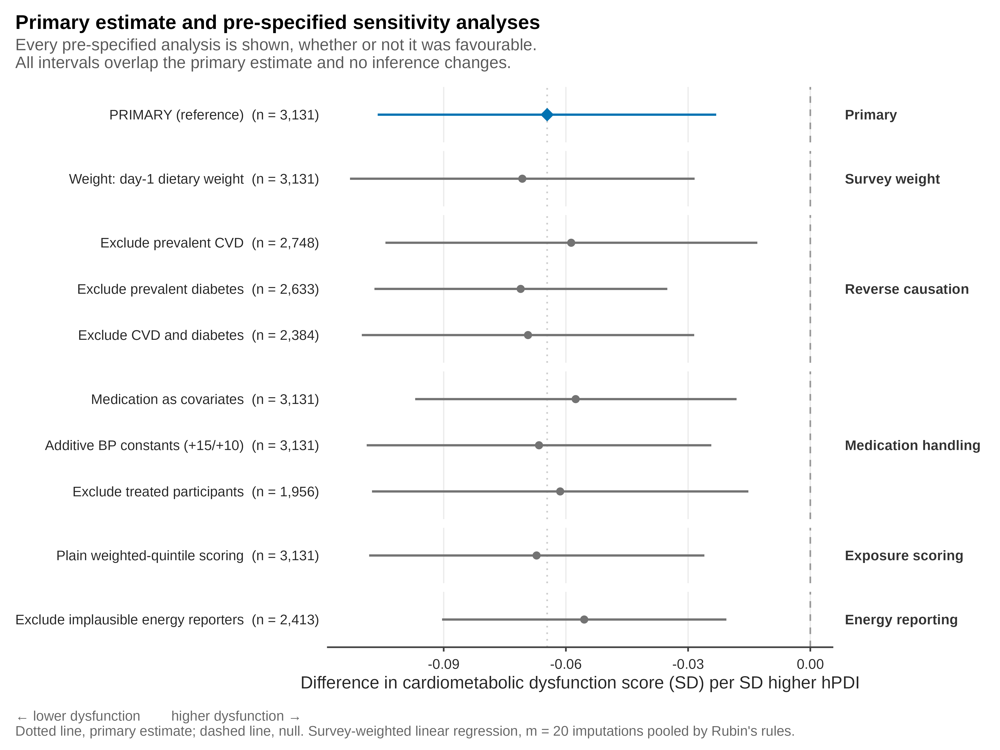
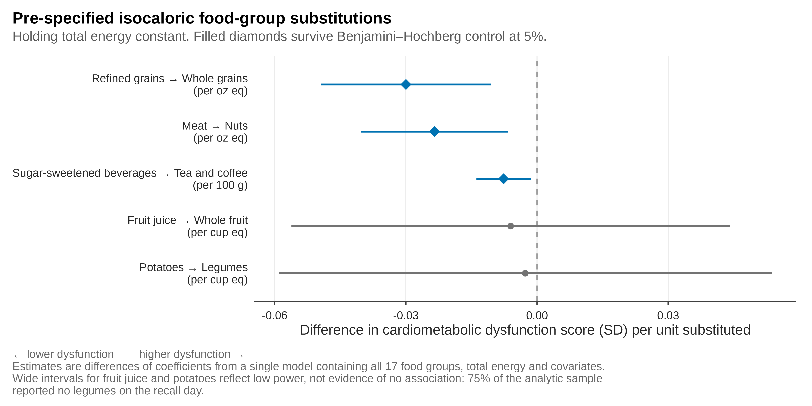
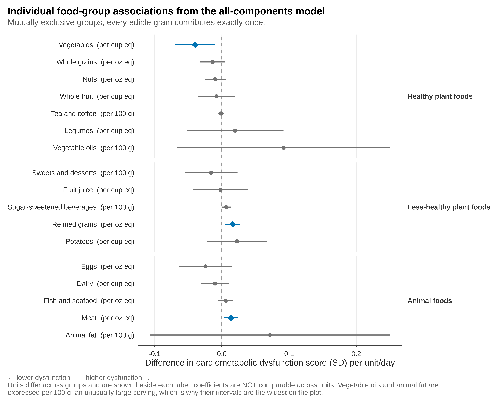
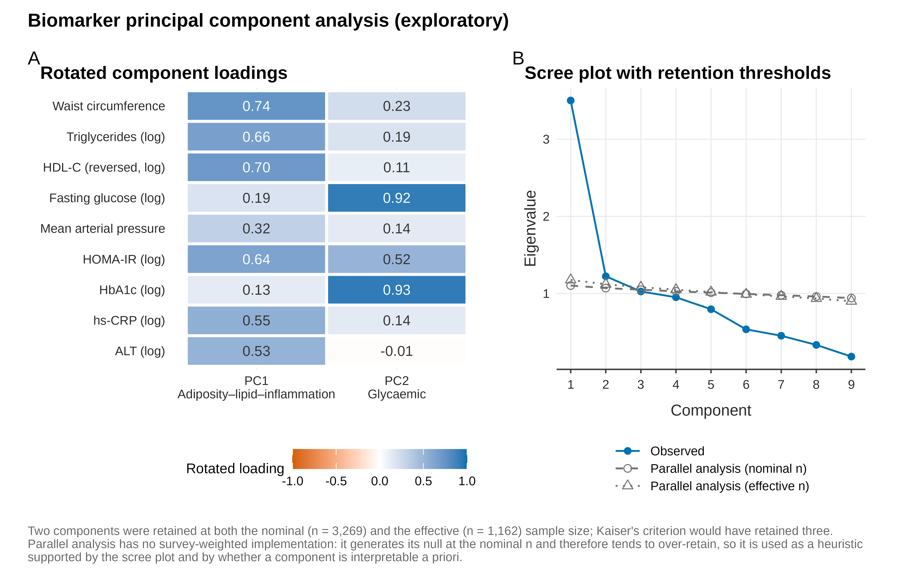
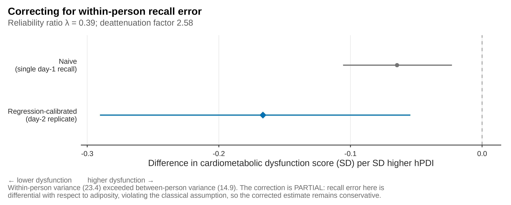
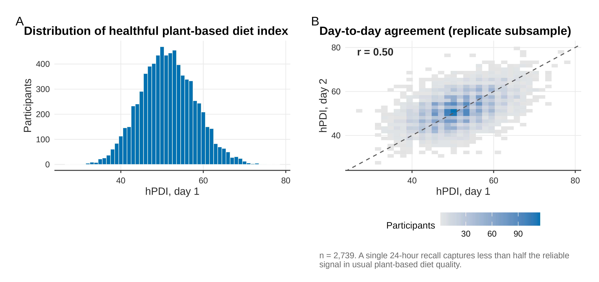

# Plant-based diet quality and cardiometabolic dysfunction in US adults

**Which plant foods carry the signal? Isocaloric food-group substitution and
measurement-error–corrected plant-based diet quality in relation to
cardiometabolic dysfunction among US adults (NHANES 2017–March 2020)**

---

## Reproducibility statement

**Every figure, table, and numerical result in this repository can be
regenerated from the official public NHANES and USDA source data using the
workflow provided here.** No manual steps, no undocumented data edits, and no
private or restricted-access inputs are involved. From a clean checkout,
`make all` downloads the raw public files, verifies them against recorded
SHA-256 checksums, and rebuilds the complete analysis end to end. Raw data are
not redistributed in this repository; they are fetched from CDC and USDA at
build time, and their provenance is recorded in `data/raw/MANIFEST.csv`.

## Design

Cross-sectional, nationally representative, survey-weighted analysis of
non-pregnant US adults aged ≥20 years. **This is an observational study.** All
estimates are associations. No causal claim is made, and the substitution
models estimate *statistical* substitutions, not intervention effects.

| | |
|---|---|
| **Data** | NHANES 2017–March 2020 pre-pandemic; USDA FPED 2017–March 2020; USDA WWEIA Food Categories |
| **Exposure** | PDI / hPDI / uPDI (Satija et al. 2016, 18 food groups), as index scores and as servings/day. HEI-2015 computed as a benchmark comparator. |
| **Primary outcome** | Continuous cardiometabolic dysfunction score: equally weighted mean of survey-weighted, sex-standardised z-scores of waist circumference, log-triglycerides, HDL-C (sign-reversed), log fasting glucose, and mean arterial pressure |
| **Primary weight** | `WTSAFPRP` (fasting subsample), per the NHANES least-common-denominator rule; verified empirically in QC |
| **Design** | `SDMVSTRA` / `SDMVPSU`, `nest = TRUE` |

## Contributions, stated honestly

No individual method used here is novel. The association between healthy
plant-based diet quality and cardiometabolic risk is already well established
and is **not** what this project claims to discover. The contribution is an
integrated, fully reproducible framework combining:

1. **Isocaloric food-group substitution within the PDI framework** — the lead
   contribution. Substitution modelling is standard; applying it inside the
   18-group plant-based diet index to identify which specific swaps carry the
   association is, to our knowledge, unexamined.
2. **Regression calibration for within-person 24-hour recall error** — the
   secondary contribution. Measurement-error correction of diet indices is an
   established literature with published NHANES applications; what we did not
   find is its application to the PDI family or to deattenuating a
   plant-based-diet exposure–outcome coefficient.
3. **Transparent survey-weighted analysis and complete computational
   reproducibility.**

Novelty statements in the manuscript are phrased as *"we identified no study
that…"*, naming databases and search dates. Scopus and Embase were not
searchable during protocol development; that gap is documented, not concealed.

## Results

Survey-weighted, cross-sectional associations in non-pregnant US adults aged
>=20 (analytic *n* = 3,131; design effect 2.74). Every number below is written
by `analysis/17_tables.R` and every figure by `analysis/18_figures.R` -- none is
transcribed by hand. Figures and tables are committed so they can be read
without installing R.

| Quantity | Estimate (95% CI) | Source table |
|---|---|---|
| **hPDI per SD -> cardiometabolic dysfunction (primary)** | **-0.065 (-0.106, -0.023)** | `T2_primary_secondary` |
| Same, corrected for within-person recall error | -0.167 (-0.290, -0.055) | `T4_calibration` |
| Reliability ratio (lambda) of a single 24-h recall | 0.388 (0.319, 0.434) | `T4_calibration` |
| uPDI per SD (unhealthful plant-based index) | 0.050 (0.015, 0.086) | `T2_primary_secondary` |
| Refined grains -> whole grains (isocaloric, per oz eq) | -0.030 (-0.050, -0.011) | `T3_substitution` |
| Meat -> nuts (isocaloric, per oz eq) | -0.023 (-0.040, -0.007) | `T3_substitution` |
| Sugar-sweetened beverages -> tea/coffee (per 100 g) | -0.008 (-0.014, -0.001) | `T3_substitution` |
| Adiposity-lipid-inflammation axis (PC1) | -0.119 (-0.179, -0.060) | `T6_axis_associations` |
| Glycaemic axis (PC2) | -0.011 (-0.060, 0.039) | `T6_axis_associations` |

Three things are worth reading off these numbers. The association sits on the
**adiposity-lipid-inflammation axis, not the glycaemic axis**. Correcting for
single-day recall error **increases the coefficient about 2.6-fold**, because a
single 24-hour recall captures less than half the reliable signal in usual diet
quality. And the healthful and unhealthful indices point in **opposite**
directions, so "plant-based" alone does not carry the signal -- which is the
question the substitution models are built to answer.

Against that, the E-value is 1.31. That is modest: residual socioeconomic
confounding is structural in this design and remains a live alternative
explanation, stated as such rather than argued away.

### Figure 1. Primary estimate and pre-specified sensitivity analyses

Every pre-specified analysis is shown whether or not it was favourable. All nine
leave the inference unchanged (beta range -0.056 to -0.071 against a primary of
-0.065).



### Figure 2. Pre-specified isocaloric food-group substitutions

Filled markers survive Benjamini-Hochberg control at 5%. The wide intervals for
fruit juice and potatoes reflect **limited power, not evidence of no
association**: 75% of the analytic sample reported no legumes on the recall day.



### Figure 3. All 17 food-group coefficients

Units differ across groups and are printed beside each label; **coefficients are
not comparable across units**. Vegetable oils and animal fat are expressed per
100 g, an unusually large serving, which is why their intervals are widest.



### Figure 4. Biomarker principal component analysis (exploratory)

Varimax-rotated loadings on the survey-weighted correlation matrix of nine
biomarkers, with a scree plot and parallel-analysis thresholds. Parallel
analysis has no survey-weighted implementation and tends to over-retain, so it
is used as a heuristic supported by the scree plot -- not as a decision rule.



### Figure 5. Effect of correcting for within-person recall error

The correction is **partial**. Recall error in these data is differential with
respect to adiposity, which violates the classical non-differential assumption,
so the calibrated estimate remains conservative.



### Figure 6. Exposure distribution and day-to-day reliability

Day-1 against day-2 index values in the replicate subsample (*n* = 2,739). The
day-to-day correlation of 0.49 is the entire motivation for the calibration
step.



Supplementary diagnostics (imputation convergence, observed-versus-imputed
distributions, and scoring-rule agreement) are in `outputs/figures/`; all 55
generated tables are in `outputs/tables/`. Captions with source-file
attribution for every item are in `docs/manuscript/CAPTIONS.md`.

## Pipeline

| Script | Purpose |
|---|---|
| `00_dag.R` | Causal DAG; **derives** the adjustment set and halts if it disagrees with the protocol |
| `01_download.R` | Fetch public data; pin and verify SHA-256 checksums |
| `02_import.R` | Read `.XPT`; validate every variable name against the frozen specification |
| `03_quality_control.R` | **Mandatory gate.** Seven check families; halts on any blocking failure |
| `04_wweia_conflicts.R` | **Adjudication gate.** Halts on any FNDDS conflict that changes a PDI group |
| `05_exposure_pdi.R` | PDI / hPDI / uPDI via hierarchical assignment; exclusive vs overlapping comparison |
| `06_outcome_composite.R` | Cardiometabolic dysfunction score; three BP-medication variants |
| `07_covariates.R` | Covariate harmonisation; analytic assembly; design effect and MDE |
| `08_missing_data.R` | Multiple imputation (m = 20) under the survey design |
| `09_models_primary.R` | Primary and secondary survey-weighted models, pooled by Rubin's rules |
| `10_calibration.R` | Regression calibration for within-person recall error |
| `11_collinearity_check.R` | **Gate.** Condition numbers and VIF before any substitution contrast |
| `12_models_substitution.R` | Isocaloric food-group substitution (lead contribution) |
| `13_pca.R` | Biomarker PCA; components named and committed before association testing |
| `14_pca_associations.R` | Axis-specific associations under the pre-registered interpretation rule |
| `15_sensitivity.R` | Nine pre-specified sensitivity analyses; single audit table |
| `16_mediation_exploratory.R` | Exploratory adiposity-pathway analysis (no proportion mediated) |
| `17_tables.R` | All manuscript tables, generated from stored objects |
| `18_figures.R` | All manuscript figures, base graphics only |
| `19_freeze_provenance.R` | Freeze analytic dataset; hash artefacts; write provenance record |

Manuscript text lives in `docs/manuscript/` (Methods, Results, Discussion), with
`docs/reproducibility_checklist.md` and `docs/PROVENANCE.md` alongside.

## Frozen protocol

`docs/variable_specification.csv` is the immutable variable contract: NHANES
variable name, units, transformation, derived name, inclusion status, and
justification for every variable, including those **deliberately excluded**
from the primary model and why. It is machine-readable and drives import
validation, so a specification that drifts from the data fails loudly rather
than silently. Amending it requires an explicit, committed protocol amendment.

## Reproducing

```bash
git clone https://github.com/ImmunoScholar/nhanes-pbdi-cardiometabolic.git
cd nhanes-pbdi-cardiometabolic
R -e 'renv::restore()'
make all
```

## Data sources

- **NHANES 2017–March 2020 pre-pandemic**, CDC/NCHS — <https://wwwn.cdc.gov/nchs/nhanes/>
- **FPED 2017–March 2020 Prepandemic**, USDA ARS Food Surveys Research Group
- **WWEIA Food Categories 2017–March 2020**, USDA ARS Food Surveys Research Group

All are public and require no application, licence, or credential.

## Licence

Code (`analysis/`, `R/`, `Makefile`): MIT, in [LICENSE](LICENSE).
Manuscript text, tables and figures (`docs/`, `outputs/`): CC BY 4.0.
Neither NHANES nor USDA source data are redistributed here; they are fetched
from CDC and USDA at build time under those agencies' own terms.

Which terms apply to which files is set out in [NOTICE.md](NOTICE.md).
